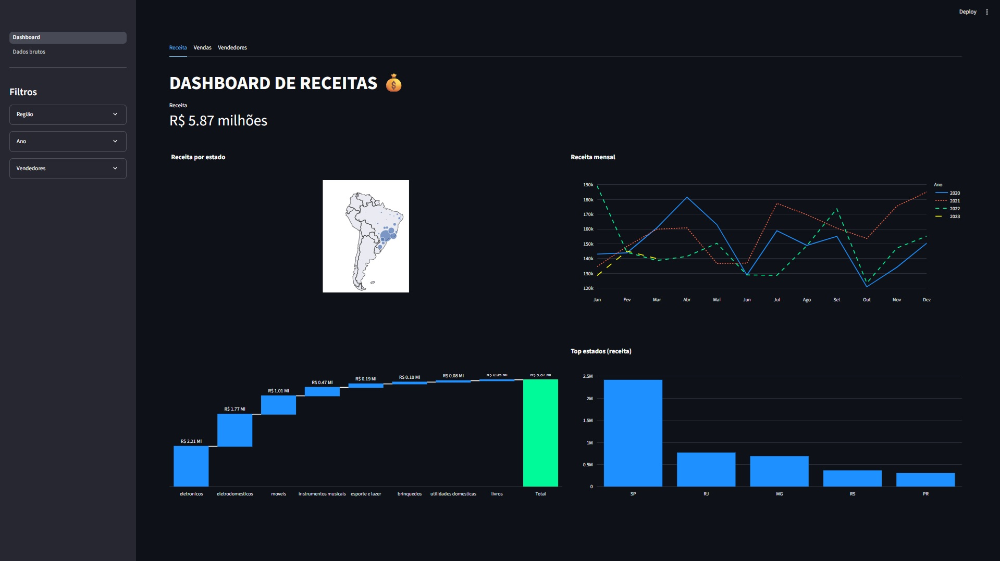
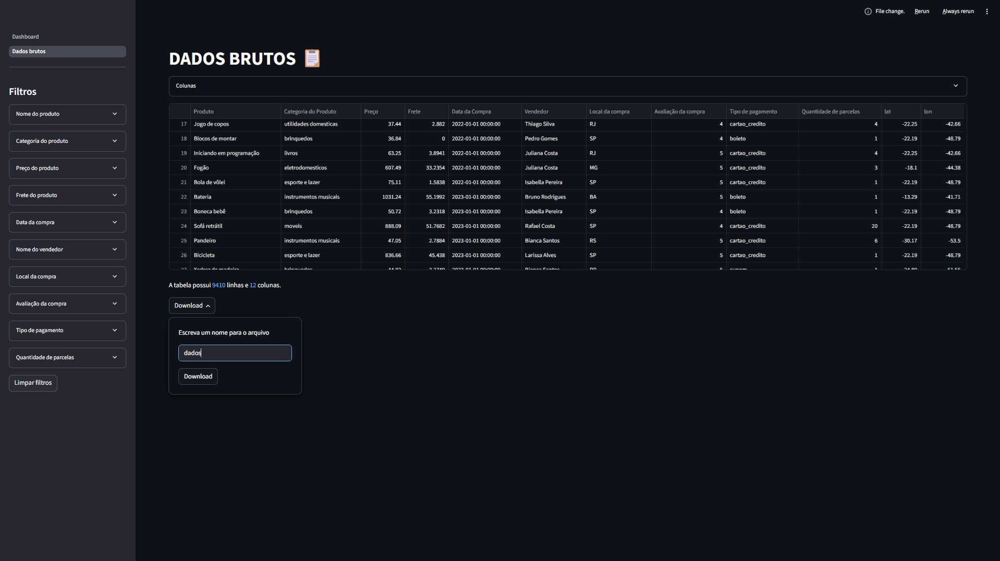

# 📊 Dashboard de Análise de Vendas
Este projeto consiste em um dashboard interativo para análise de dados de vendas, desenvolvido com Streamlit. A aplicação consome dados de uma API pública, processa-os e os apresenta em visualizações dinâmicas, permitindo uma exploração aprofundada da performance de vendas por região, período, categorias e vendedores.

---

## 🚀 Funcionalidades
- 📈 Visualização interativa de indicadores de vendas.
- 🔍 Consulta de dados brutos de forma organizada.
- 🎨 Interface amigável e responsiva.
- 📊 Gráficos dinâmicos e filtros customizados.

---

## 🖼 Preview Dashboard
- Receita 💰: Métricas e gráficos focados no faturamento.
- Vendas 🛒: Análises sobre a quantidade de itens vendidos.
- Vendedores 🤝: Performance individual e comparativa dos vendedores.
- Filtros Dinâmicos: Uma barra lateral (sidebar) permite filtrar os dados
### 📌 Tela do Dashboard

## 🖼 Preview Dados brutos
- Explorador de Dados: Uma página dedicada para visualizar os dados em formato de tabela.
- Filtragem Avançada: Permite ao usuário filtrar os dados com múltiplos critérios simultaneamente
- Seleção de Colunas: O usuário pode escolher quais colunas deseja exibir na tabela.
- Download de Dados: Funcionalidade para baixar os dados filtrados em um arquivo .csv, com nome personalizável.
### 📌 Tela de Dados Brutos

---

## 🚀 Tecnologias & Ferramentas utilizadas

> **Python** Linguagem de programação principal.
> **Streamlit** Framework para a criação da aplicação web interativa.
> **Pandas** Para manipulação e análise dos dados.
> **Plotly Express & Plotly Graph Objects** Para a criação dos gráficos interativos.
> **Requests** Para fazer requisições HTTP à API de dados.
> **Git & GitHub** Para controle de versão e hospedagem do código.

---

## ⚙️ Como Executar o Projeto
### Siga os passos abaixo para executar o dashboard em sua máquina local.
**Pré-requisitos**
- Python 3.8 ou superior
- pip (gerenciador de pacotes do Python)

1. Clone o Repositório
git clone https://github.com/seu-usuario/seu-repositorio.git
cd seu-repositorio

2. Crie e Ative um Ambiente Virtual
É uma boa prática usar um ambiente virtual para isolar as dependências do projeto.

3. Instale as Dependências
Crie um arquivo chamado requirements.txt na raiz do projeto com o seguinte conteúdo:
streamlit, pandas, plotly, requests
Em seguida, instale as bibliotecas com o comando: pip install -r requirements.txt

4. Execute a Aplicação
Para iniciar o dashboard, execute o arquivo principal. 
streamlit run Dashboard.py

5. Veja no seu navegador
Abra seu navegador e acesse o endereço http://localhost:8501.

---

## 📂 Estrutura do Projeto
├── .streamlit/
│   └── config.toml      # Configurações de tema do Streamlit
├── imagens/
│   ├── tela_dadosbrutos.jpg  # Imagens do projeto
│   └── tela_dashboard.jpg
├── pages/
│   └── Dados brutos.py  # Segunda página da aplicação
├── venv/                # Ambiente virtual (ignorado pelo .gitignore)
├── .gitignore           # Arquivos a serem ignorados pelo Git
├── Dashboard.py         # Arquivo principal da aplicação
├── README.md            # Arquivo sobre o projeto
└── requirements.txt     # Lista de dependências do projeto

---

## 🔗 Fonte de Dados
Os dados utilizados neste dashboard são provenientes da API pública do LabDados, que fornece um conjunto de dados simulado de vendas de produtos.

--- 

👨‍💻 Autor
Criado por Fabio Cerqueira.

